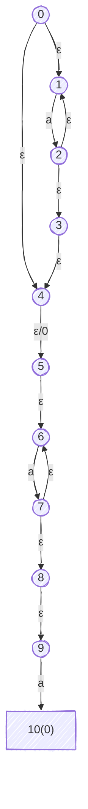

```mermaid
---
  config:
    look: handDrawn
---
graph TD
0-->|"ε"|1
0-->|"ε"|4
1-->|"a"|2
2-->|"ε"|1
2-->|"ε"|3
3-->|"ε"|4
4-->|"ε/0"|5
5-->|"ε"|6
6-->|"a"|7
7-->|"ε"|6
7-->|"ε"|8
8-->|"ε"|9
9-->|"a"|10
0((0))
1((1))
2((2))
3((3))
4((4))
5((5))
6((6))
7((7))
8((8))
9((9))
10["10(0)"]
```
