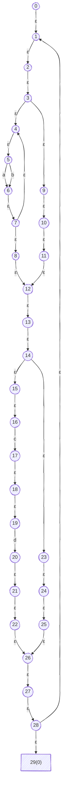

```mermaid
---
  config:
    look: handDrawn
---
graph TD
0-->|"ε"|1
1-->|"ε"|2
2-->|"ε"|3
3-->|"ε"|4
3-->|"ε"|9
4-->|"ε"|5
5-->|"a"|6
5-->|"b"|6
6-->|"ε"|7
7-->|"ε"|4
7-->|"ε"|8
8-->|"ε"|12
9-->|"ε"|10
10-->|"ε"|11
11-->|"ε"|12
12-->|"ε"|13
13-->|"ε"|14
14-->|"ε"|15
14-->|"ε"|23
15-->|"ε"|16
16-->|"c"|17
17-->|"ε"|18
18-->|"ε"|19
19-->|"d"|20
20-->|"ε"|21
21-->|"ε"|22
22-->|"ε"|26
23-->|"ε"|24
24-->|"ε"|25
25-->|"ε"|26
26-->|"ε"|27
27-->|"ε"|28
28-->|"ε"|1
28-->|"ε"|29
0((0))
1((1))
2((2))
3((3))
4((4))
5((5))
6((6))
7((7))
8((8))
9((9))
10((10))
11((11))
12((12))
13((13))
14((14))
15((15))
16((16))
17((17))
18((18))
19((19))
20((20))
21((21))
22((22))
23((23))
24((24))
25((25))
26((26))
27((27))
28((28))
29["29(0)"]
```
