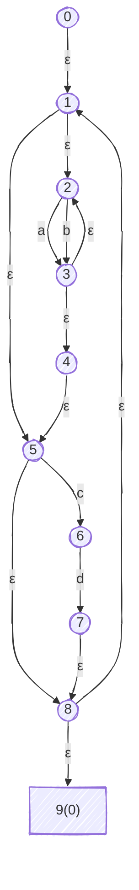

```mermaid
---
  config:
    look: handDrawn
---
graph TD
0-->|"ε"|1
1-->|"ε"|2
1-->|"ε"|5
2-->|"a"|3
2-->|"b"|3
3-->|"ε"|2
3-->|"ε"|4
4-->|"ε"|5
5-->|"ε"|8
5-->|"c"|6
6-->|"d"|7
7-->|"ε"|8
8-->|"ε"|1
8-->|"ε"|9
0((0))
1((1))
2((2))
3((3))
4((4))
5((5))
6((6))
7((7))
8((8))
9["9(0)"]
```
